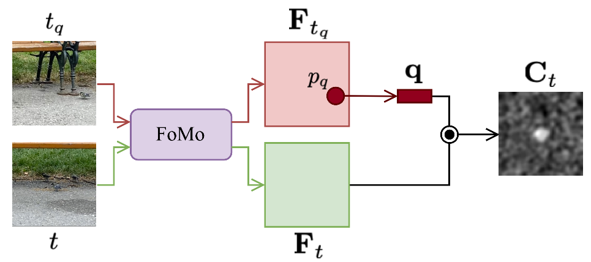

# Can Visual Foundation Models Achieve Long-term Point Tracking?
### [Paper](https://arxiv.org/abs/2408.13575) | [Webpage](https://kuis-ai.github.io/fomo_pt/)
This is the official implementation of the paper *Can Visual Foundation Models Achieve Long-term Point Tracking?* presented in Emergent Visual Abilities and Limits of Foundation Models (EVAL-FoMo) Workshop - ECCV 2024.

## Introduction

### 1\. Clone the Repository
```
git clone https://github.com/gorkaydemir/fomo_point_tracking.git
cd fomo_point_tracking
```

### 2\. Setup the Environment
Create a Conda environment and install the required dependencies:
```
conda create -n fomo_point_tracking
conda activate fomo_point_tracking
conda install pytorch==2.3.1 torchvision==0.18.1 torchaudio==2.3.1 pytorch-cuda=12.1 -c pytorch -c nvidia
pip install -r requirements.txt
```
### 3\. Download and Prepare TAP-Vid Dataset

Follow the steps outlined in the [TAPNet](https://github.com/google-deepmind/tapnet/tree/main/tapnet/tapvid) repository to download and set up the TAP-Vid dataset at `root/to/tap_vid`.


## Zero-Shot Evaluation
To perform zero-shot evaluation on the TAP-Vid benchmark using a single GPU, run the following command:
```
python zero_shot.py \
--tapvid_root root/to/tap_vid --eval_dataset dataset_option  \
--final_feature_size 32 32 --backbone model_option
```

Example: Evaluating on TAP-Vid DAVIS using DINOv2-small
```
python zero_shot.py \
--tapvid_root root/to/tap_vid --eval_dataset "davis_first" \
--final_feature_size 32 32 --backbone "dinov2_s_14"
```


## Adaptation with DINOv2
### 1\. Probing
For probing on multiple GPUs with default parameters, run the following:
```
OMP_NUM_THREADS=5 torchrun --master_port=12345 --nproc_per_node=#gpus adaptation.py \
--mode "probe" \
--movi_f_root root/to/tap_vid_kubric --augmentation \
--tapvid_root root/to/tap_vid
```

### 2\. Low-Rank Adaptation (LoRA)

To perform low-rank adaptation (LoRA) on multiple GPUs with default parameters:

```
OMP_NUM_THREADS=5 torchrun --master_port=12345 --nproc_per_node=#gpus adaptation.py \
--mode "lora" --lora_rank 32 \
--movi_f_root root/to/tap_vid_kubric --augmentation \
--tapvid_root root/to/tap_vid
```

## Citation

If you use this code in your research, please cite the following:
```bibtex
@article{aydemir2024can,
            title={Can Visual Foundation Models Achieve Long-term Point Tracking?},
            author={Aydemir, G{\"o}rkay and Xie, Weidi and G{\"u}ney, Fatma},
            journal={arXiv preprint arXiv:2408.13575},
            year={2024}
          }
```

## Acknowledgments
This repository incorporates code from several public works, including [CoTracker](https://github.com/facebookresearch/co-tracker), [TAPNet](https://github.com/google-deepmind/tapnet), [SLiMe](https://github.com/aliasgharkhani/slime), and [MeLo](https://github.com/JamesQFreeman/LoRA-ViT). Special thanks to the authors of these projects for making their code available.